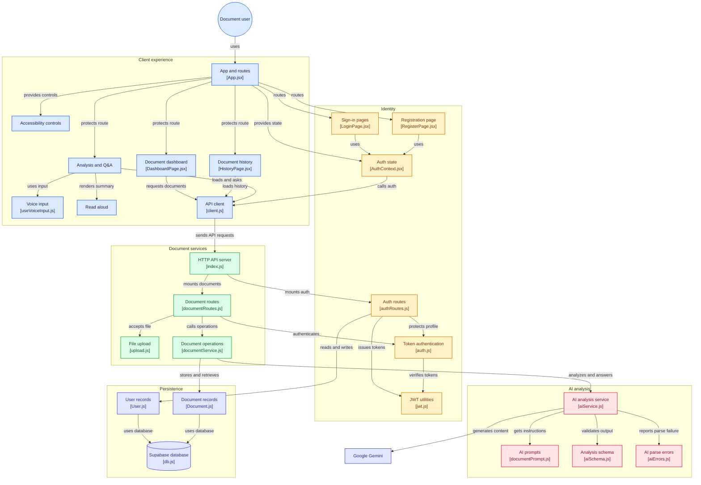

# Samajh (समझ / ತಿಳುವಳಿಕೆ)
> **AI-Powered Document Simplification for Accessibility & Inclusion**

[](LICENSE)
[]()
[]()

---

## 📌 Problem Statement
Millions of people—especially the elderly, citizens with low digital literacy, visual or cognitive impairments, and non-English speakers—receive critical government tax notices, bank KYC letters, court summons, and subsidy forms they cannot read or comprehend. 

As a result:
- They miss critical deadlines and incur heavy penalties.
- They fall prey to scam letters demanding OTPs, upfront registration fees, or sensitive passwords.
- They depend on predatory middlemen or unverified third parties to read their personal papers.

---

## 💡 The Solution: Samajh
**Samajh** ("understanding") is an accessible, human-first web application. A user simply takes a photo or uploads a PDF of any official document. Google Gemini natively parses the document (no third-party OCR step required) and returns a plain-language explanation written at a **5th-grade reading level** in **English, Hindi, or Kannada**.

### Key Features
1. **5th-Grade Plain Language Explanation**: Strips away legal and bureaucratic jargon, explaining complex clauses in short, friendly sentences.
2. **Prioritized Action Checklist**: Breaks down what the recipient must do first, with clear deadlines attached.
3. **Scam & Fraud Safeguard**: Scrutinizes notices for common scam signatures (requests for Aadhaar OTPs, UPI/ATM PINs, or advance fees) and displays high-visibility alert warnings.
4. **Multilingual Speech Synthesis (Read Aloud)**: High-quality browser TTS reads aloud entire summaries, actions, and answers in Indian regional dialects (`en-IN`, `hi-IN`, `kn-IN`).
5. **Interactive Voice & Text Q&A**: Users can ask natural follow-up questions ("What happens if I delay payment?") by typing or speaking through their microphone.
6. **Universal Accessibility Engine**:
   - Dynamic text scaling (100% to 200%)
   - High-contrast yellow-on-black theme (WCAG AAA compliant)
   - Dyslexia-friendly typography toggle (Atkinson Hyperlegible)
   - Increased letter and line spacing
   - Skip to main content navigation & full keyboard operability
7. **Zero File Retention Privacy**: Uploaded documents are processed entirely in memory. Uploaded files are never stored on disk or shared.

---

## 🏗️ Architecture & System Design

[](https://gitdiagram.com/afnan-0206/ai-for-accessibility-inclusion?utm_source=readme&utm_medium=badge)
[](client/public/architecture.html)

Explore the system interactively:
- **In-App Explorer:** Visit `/architecture` in the web application for an interactive zoomable, searchable canvas with layer inspectors.
- **Standalone Interactive HTML:** Open [`.archify/architecture-samajh/architecture-samajh.html`](.archify/architecture-samajh/architecture-samajh.html) or [`client/public/architecture.html`](client/public/architecture.html) directly in any browser.



### ⚡ Archify Skill Integration
This project integrates the **[Archify](https://github.com/tt-a1i/archify)** AI architecture diagram generator skill located at [`.agents/skills/archify`](.agents/skills/archify).

You can generate, validate, and render new architecture, sequence, and workflow diagrams at any time using:
```bash
# Render interactive architecture diagram
node .agents/skills/archify/bin/archify.mjs render architecture .archify/architecture-samajh/candidate.json client/public/architecture.html --quality standard
```

---

## 🛠️ Technology Stack

| Layer | Technologies |
|---|---|
| **Frontend** | React 18, Vite, Tailwind CSS, React Router v6, Axios, Lucide Icons |
| **Accessibility & Speech** | Web Speech API (`SpeechSynthesis`, `SpeechRecognition`), Atkinson Hyperlegible |
| **Backend** | Node.js (ESM), Express 5, Multer (Memory Storage), Helmet, CORS, Morgan |
| **Authentication & Security** | JWT (JSON Web Tokens), bcryptjs password hashing, express-rate-limit |
| **Validation** | Zod (strict schema enforcement for AI responses and API inputs) |
| **Database** | MongoDB Atlas with Mongoose (with in-memory fallback for local dev) |
| **Artificial Intelligence** | Google Gemini (`@google/genai` SDK, multimodal inlineData analysis) |
| **Hosting & CI/CD** | Frontend: Vercel • Backend: Render • Database: MongoDB Atlas |

---

## 🚀 Local Setup & Installation

### Prerequisites
- Node.js (v20.6.0 or higher recommended, tested on Node v24)
- npm or pnpm
- Google Gemini API Key ([Get one free from Google AI Studio](https://aistudio.google.com/app/apikey))

### 1. Clone the Repository
```bash
git clone https://github.com/Afnan-0206/AI-for-Accessibility-Inclusion.git
cd AI-for-Accessibility-Inclusion
```

### 2. Configure Backend Environment
Create `server/.env`:
```env
PORT=5000
MONGODB_URI=mongodb+srv://<username>:<password>@cluster.mongodb.net/samajh?retryWrites=true&w=majority
JWT_SECRET=samajh_super_secret_jwt_key_at_least_32_characters
GEMINI_API_KEY=your_gemini_api_key_here
GEMINI_MODEL=gemini-3.8-flash
CLIENT_ORIGIN=http://localhost:5173
```
*(Note: If `MONGODB_URI` is omitted during local development, Samajh gracefully uses an in-memory repository).*

### 3. Configure Frontend Environment
Create `client/.env`:
```env
VITE_API_URL=http://localhost:5000/api
VITE_USE_MOCK=false
```
*(Set `VITE_USE_MOCK=true` if you wish to run the frontend purely in offline demo mode without running the backend).*

### 4. Install Dependencies & Run

#### Run the Backend:
```bash
cd server
npm install
npm run dev
```
Backend runs on `http://localhost:5000`. Test health: `http://localhost:5000/api/health`.

#### Run the Frontend:
```bash
cd ../client
npm install
npm run dev
```
Frontend runs on `http://localhost:5173`.

---

## 🧪 Testing the AI Pipeline

You can run automated smoke tests against sample government notices (English property tax, Hindi SBI KYC, Kannada scholarship, and an OTP scam letter):

```bash
cd server
npm run test:ai
```

---

## 📡 API Contract

| Method | Endpoint | Protection | Description |
|---|---|---|---|
| `GET` | `/api/health` | Public | System health check (`{"status":"ok"}`) |
| `POST` | `/api/auth/register` | Public | Register user (`{name, email, password}`) |
| `POST` | `/api/auth/login` | Public | Authenticate user (`{email, password}`) |
| `GET` | `/api/auth/me` | Bearer Token | Retrieve current user profile |
| `POST` | `/api/documents/analyze` | Bearer Token | Multipart upload (`file`, `language`) -> returns structured analysis |
| `GET` | `/api/documents` | Bearer Token | List all user documents (newest first) |
| `GET` | `/api/documents/:id` | Bearer Token | Fetch full analysis for a single document |
| `DELETE` | `/api/documents/:id` | Bearer Token | Delete document from user history |
| `POST` | `/api/documents/:id/ask` | Bearer Token | Ask contextual follow-up question (`{question, language}`) |

---

## 🚢 Deployment Guide

### Backend on Render:
1. Connect GitHub repository and set **Root Directory** to `server`.
2. Build Command: `npm install`
3. Start Command: `node src/index.js`
4. Set Environment Variables:
   - `PORT`: `5000`
   - `MONGODB_URI`: `<Your MongoDB Atlas connection URI>`
   - `JWT_SECRET`: `<Secure random secret>`
   - `GEMINI_API_KEY`: `<Your Gemini API Key>`
   - `GEMINI_MODEL`: `gemini-3.8-flash`
   - `CLIENT_ORIGIN`: `https://your-frontend.vercel.app`
> *Note: Render free tier web services spin down after 15 minutes of inactivity; initial requests may take 30–50 seconds to boot.*

### Frontend on Vercel:
1. Import repository and set **Root Directory** to `client`.
2. Framework Preset: `Vite`
3. Set Environment Variable:
   - `VITE_API_URL`: `https://your-backend.onrender.com/api`
   - `VITE_USE_MOCK`: `false`
4. Deploy. The included `client/vercel.json` ensures full client-side route rewrites.

---

## 🛡️ Responsible AI & Ethical Safeguards
- **Privacy by Design**: Uploaded photos and PDFs are parsed in RAM and discarded immediately. No documents are stored on server disk or database.
- **Explicit Disclaimers**: Samajh provides assistive plain-language explanations, not formal legal or financial advice. Every analysis and Q&A response appends localized disclaimers.
- **Prompt Injection Hardening**: All user documents are demarcated strictly as passive data. Embedded jailbreaks (e.g. "Ignore previous instructions") are neutralized.
- **Zero Hallucination Safeguard**: The model is instructed to preserve numbers, amounts, dates, and names verbatim, and explicitly admit when requested information is absent.

---

## 🔮 Future Scope
- **WhatsApp Bot Integration**: Directly receive notices and voice notes via WhatsApp and reply with voice audio messages.
- **Form Filling Assistance**: Interactive voice guide explaining how to fill out government application forms field by field.
- **Offline Edge AI**: Lightweight client-side quantized multimodal models for zero-connectivity rural scenarios.
